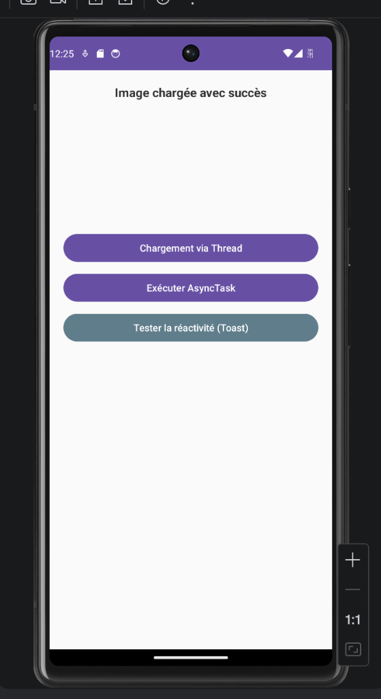
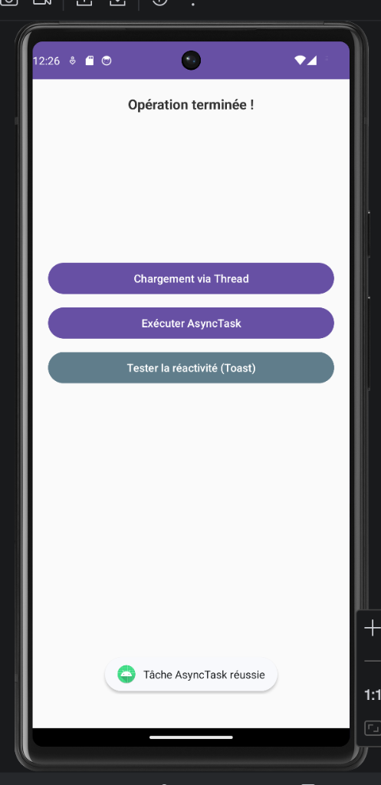

# LAB 8 — Threads, AsyncTask et Handler

## 🎯 Objectifs du Projet

Dans Android, effectuer des opérations lourdes (calculs, accès réseau, lecture de fichiers) sur le **Main Thread** bloque l'interface et provoque des erreurs de type **"Application Not Responding" (ANR)**.

Ce projet implémente deux solutions pour éviter ce blocage :

- **Thread & Handler** : Communication manuelle entre un thread secondaire et l'UI.
- **AsyncTask** : Utilisation d'une structure intégrée pour gérer le cycle de vie d'une tâche de fond.

---

## 🚀 Fonctionnalités

- **Simulateur de Chargement (Thread)** : Téléchargement fictif d'une image avec retour sur l'UI via un `Handler`.
- **Calcul Intensif (AsyncTask)** : Exécution d'une boucle de calcul avec mise à jour en temps réel d'une `ProgressBar`.
- **Test de Réactivité** : Un bouton "Toast" permettant de vérifier que l'application reste utilisable même pendant les traitements lourds.

---

## 🛠️ Stack Technique

| Élément       | Détail                                                    |
|---------------|-----------------------------------------------------------|
| **Langage**   | Java                                                      |
| **IDE**       | Android Studio                                            |
| **Composants**| `LinearLayout`, `ProgressBar`, `ImageView`, `AsyncTask`, `Handler`, `Looper` |

---

## 📂 Structure du Code

- **`MainActivity.java`** : Gère l'initialisation des vues et le déclenchement des processus asynchrones.
- **`BackgroundProcessor`** (classe interne) : Implémentation de l'`AsyncTask` avec les méthodes `onPreExecute`, `doInBackground`, `onProgressUpdate` et `onPostExecute`.
- **`activity_main.xml`** : Design de l'interface utilisateur utilisant un `LinearLayout` optimisé.

---

## ⚙️ Installation & Test

1. **Cloner le dépôt** :
   ```bash
   git clone https://github.com/Oumaymaa659/LAB-8---Threads-AsyncTask-et-Handler.git
   ```
2. **Ouvrir** le projet dans Android Studio.
3. **Lancer** l'émulateur.
4. **Test de validation** : Cliquez sur **"Exécuter AsyncTask"** puis immédiatement sur **"Afficher Toast"**. Si le message apparaît sans délai, le multithreading est validé ! ✅

---

## 📸 Captures des Tests

### Chargement via Thread & Handler
<p align="center">
  
</p>

> Le texte **"Image chargée avec succès"** confirme le bon fonctionnement du `Thread` + `Handler`.

### Exécution AsyncTask
<p align="center">
  
</p>

> Le message **"Opération terminée !"** et le Snackbar **"Tâche AsyncTask réussie"** confirment le bon fonctionnement de l'`AsyncTask`. Le Toast reste accessible pendant l'exécution, prouvant que l'UI ne bloque pas.
